# walkagift

A new Flutter project.

## Getting Started

This project is a starting point for a Flutter application.

A few resources to get you started if this is your first Flutter project:

- [Lab: Write your first Flutter app](https://docs.flutter.dev/get-started/codelab)
- [Cookbook: Useful Flutter samples](https://docs.flutter.dev/cookbook)

For help getting started with Flutter development, view the
[online documentation](https://docs.flutter.dev/), which offers tutorials,
samples, guidance on mobile development, and a full API reference.
# Project Name
Walk Gift App
## Description
Walk App is a health motivation application designed to encourage users to increase their daily steps
and improve their physical activity. 
By tracking footsteps, users can convert them into points, which can then be redeemed for various gifts. 
The app aims to provide a fun and engaging way to motivate users to walk more and live a healthier lifestyle.

Platform & Target Audience

Platform: Android & iOS
Target Audience: Health-conscious individuals looking to stay motivated and improve their physical activity.
Technologies & Tools

Development Tool: Android Studio
Framework: Flutter-based project
Design Architecture: MVVM, MVC
Database: Firebase
Security: SHA512 encryption for secure data storage
State Management: Getx
Key Features

Google API Integration: Google Fitness API for step tracking and fitness data synchronization
Admin Control: An admin panel is designed in Android for managing user data and app settings
Extra Services:
Push Notifications for user engagement
In-app sharing features
Terms and Conditions section for user guidelines
Server-side TimeSteps for enhanced security
App Motivation & User Engagement
The primary goal of Walk App is to motivate users to walk more by offering rewards for physical activity.
As users increase their daily steps, they earn points, which can be used to purchase various gifts, 
creating a rewarding experience that encourages consistent engagement and physical fitness.
## Screenshots
### Home Page
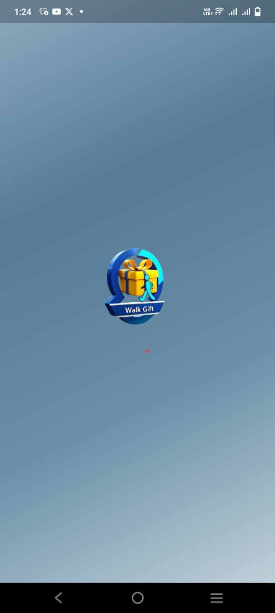
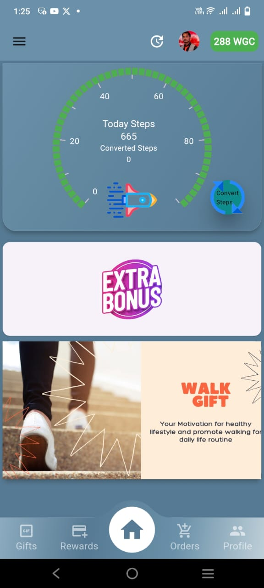
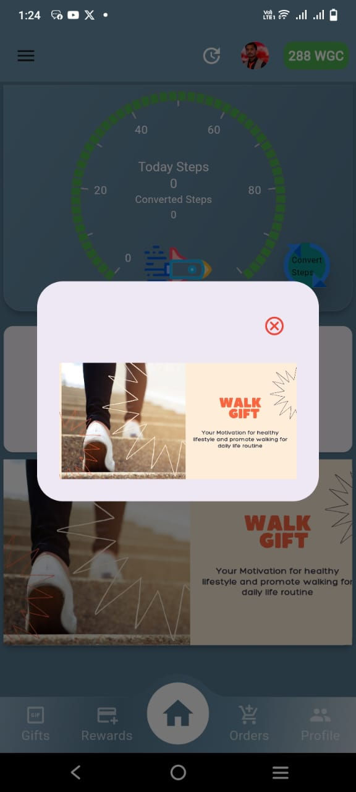
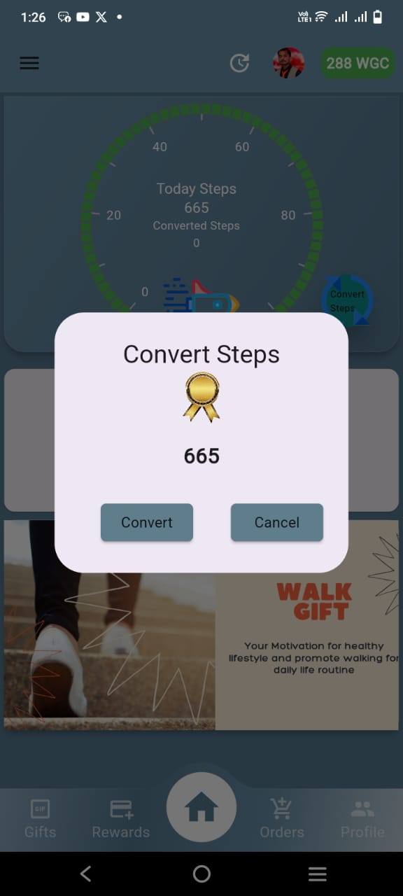
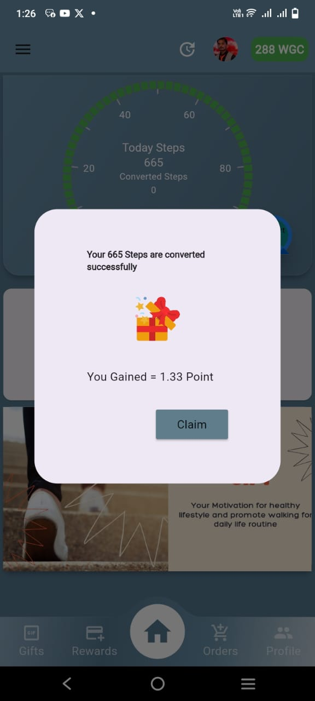

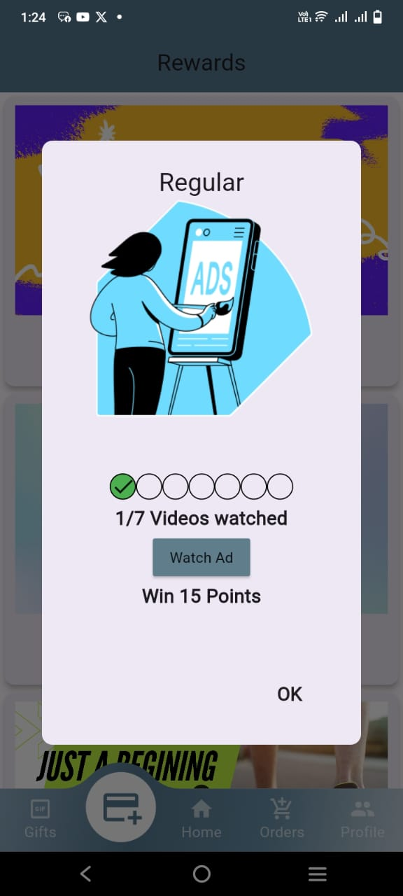
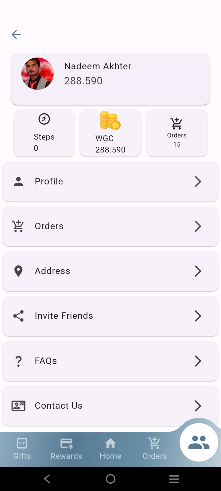
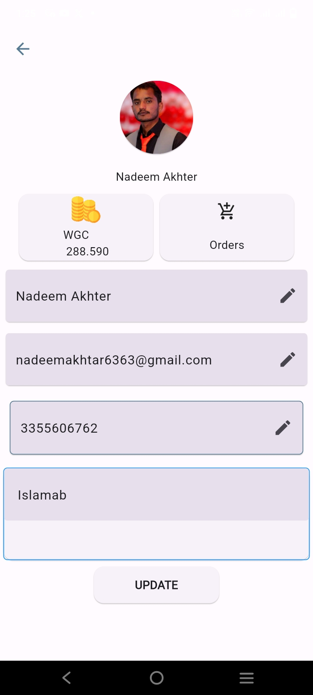
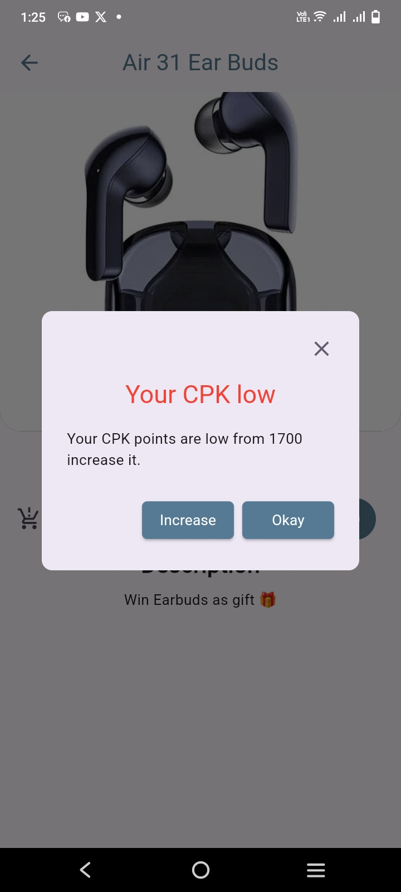
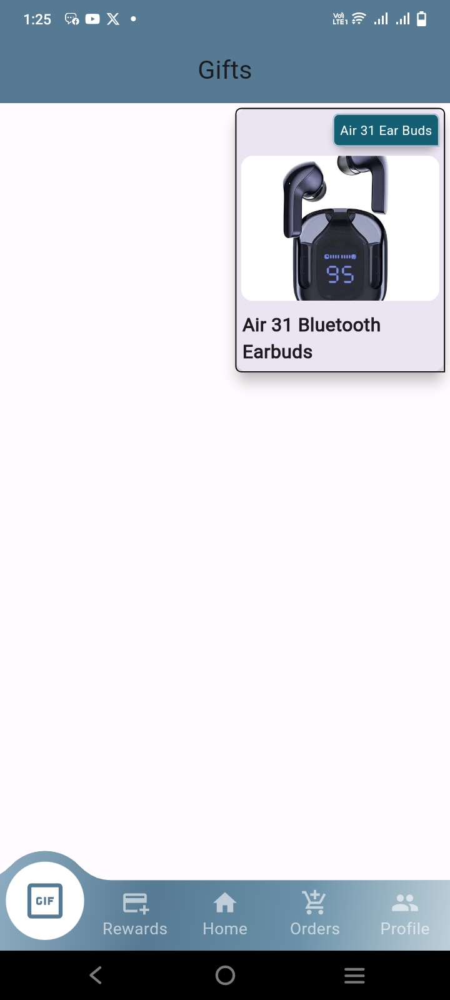

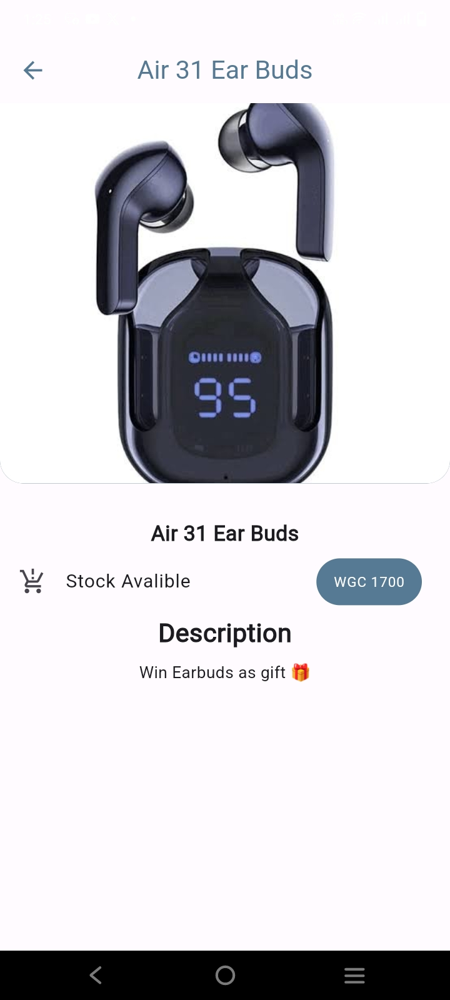

### Workflow Diagram

[//]: # (![Workflow Diagram]&#40;images/workflow-diagram.png&#41;)